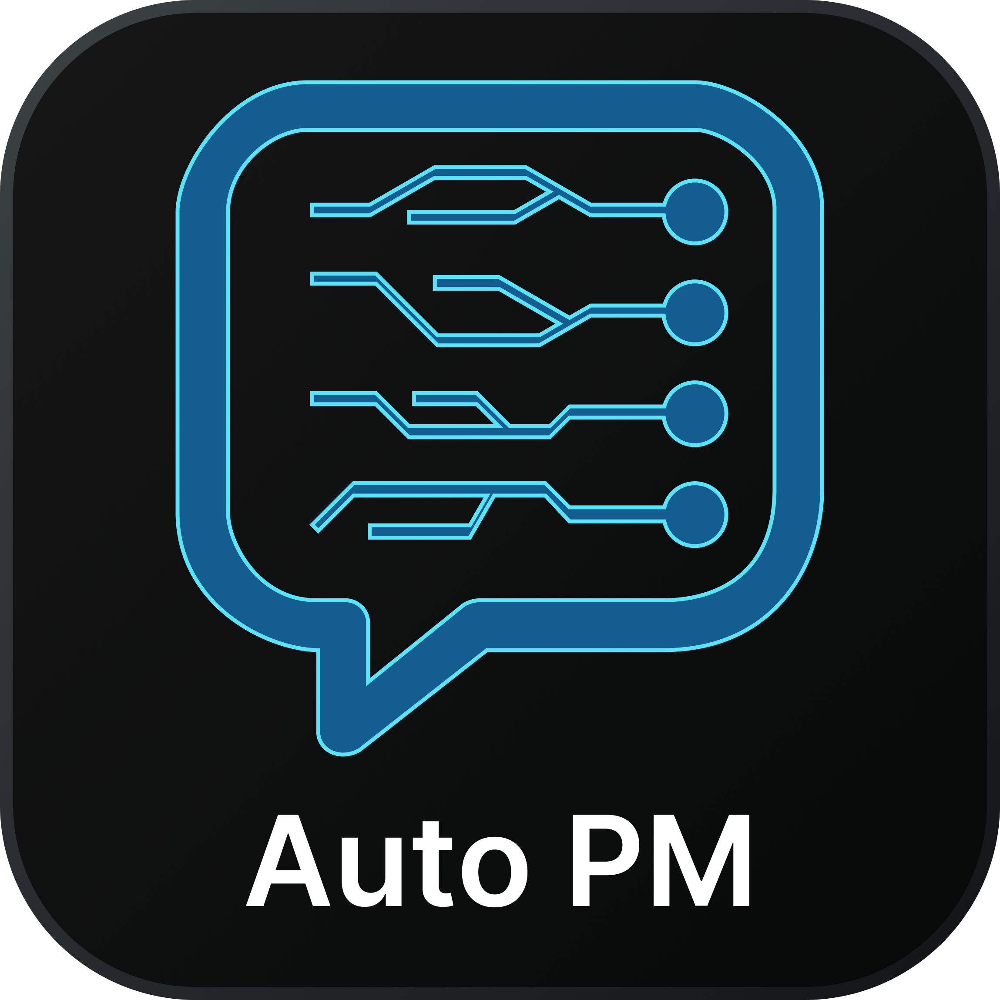

<p align="center">
  
</p>

<h1 align="center">Auto-PM (Autonomous Project Manager)</h1>

<p align="center">
  <strong>An autonomous webhook orchestrator that securely bridges GitHub and Slack.</strong><br>
  <em>Built with strict OOP, async architecture, and zero-trust environment configuration to eliminate technical project management overhead.</em>
</p>

<p align="center">
  
  
</p>

<hr>

## 🚀 The Problem it Solves
Engineering Managers and CTOs hate nagging developers for status updates. Developers hate interrupting their workflow to manually update project boards or ping Slack channels. 

**Auto-PM completely eliminates this friction.** It acts as a digital Project Manager that silently listens for GitHub commits and autonomously broadcasts professional, formatted updates directly to your team's Slack channel.

## ⚙️ Architecture & Features
* **Zero-Trust Security:** API keys are never hardcoded. Handled strictly via local `.env` injection.
* **Node.js Native:** Built natively in JavaScript for ultra-fast webhook processing.
* **Async Event Loop:** Non-blocking webhook receiver.
* **Intelligent Summarization:** Automatically parses raw GitHub JSON payloads into readable, human-friendly status reports.

## 📦 Installation

**Install globally via NPM:**
```bash
npm install -g auto-pm-webhook
```

## 🗺️ Roadmap
* [x] **v1.0.0:** Native Node.js CLI & Webhook Server
* [ ] **v2.0.0 (Coming Soon):** Native Python support and PyPI global package distribution.

## 🛠️ Usage

### 1. Initialization
Run the setup command to securely generate your local environment configuration file:
```bash
auto-pm setup
```
*(Open the newly created `.env` file and paste your Slack Webhook URL).*

### 2. Launch the Autonomous Agent
Start the background listener:
```bash
auto-pm start
```
*The agent will now silently listen on port 8000 for incoming GitHub webhooks.*
